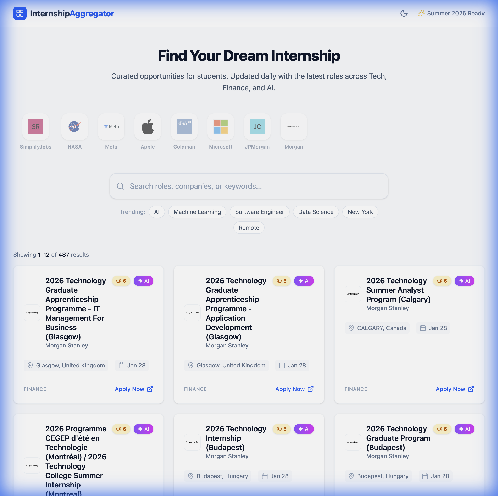

# 🎓 Internship Aggregator

[](https://reactjs.org/)
[](https://fastapi.tiangolo.com/)
[](https://www.sqlite.org/)
[](https://tailwindcss.com/)

[English] | [简体中文](./README.zh-CN.md)

A powerful full-stack internship aggregation platform designed to help students find, filter, and track their dream internships. Specifically optimized for Summer 2026 internship cycles.



---

## 📖 Project Overview

**Internship Aggregator** is a modern web application that solves the problem of scattered internship information. It automatically collects listings from trusted sources, processes them with intelligent tagging, and presents them in a clean, searchable interface.

Whether you're looking for AI/ML specific roles or need to know if a company is friendly to international students (H1B/Visa support), this tool provides the insights you need at a glance.

## 🚀 Core Features

- 🕷️ **Automated Crawler**: Real-time synchronization with high-quality internship repositories.
- 🔍 **Advanced Filtering**: Search by company, role, location, or industry with instant results.
- 🤖 **AI-Role Highlighting**: Automatically identifies and tags roles related to Artificial Intelligence and Machine Learning.
- 🌍 **International Student Focus**: Includes a "Friendliness Score" (1-10) to indicate visa sponsorship likelihood.
- ⚡ **Minimalist UI**: Responsive design built with Tailwind CSS for a seamless desktop and mobile experience.
- 📊 **One-Click Apply**: Direct links to application pages to save you time.

## 📂 Rich Data Ecosystem

The core competency of the Internship Aggregator lies in its **unparalleled data richness**. Unlike other platforms that rely on a single source, we aggregate high-quality listings from a diverse network of sources, ensuring you never miss an opportunity.

### 🌟 Primary Data Sources

We aggregate data from high-quality community-driven sources:

| Source Type | Source Name | Update Frequency | Description |
|-------------|-------------|------------------|-------------|
| **Community** | [SimplifyJobs GitHub](https://github.com/SimplifyJobs/Summer2026-Internships) | **Real-time** | The largest community-driven internship repository. |
| **Official** | [Goldman Sachs](https://www.goldmansachs.com/careers) | **Crawled** | Official Goldman Sachs internship programs. |
| **Official** | [Apple Careers](https://jobs.apple.com) | **Crawled** | Engineering and Operations internships at Apple. |
| **Official** | [Meta Careers](https://www.metacareers.com) | **Crawled** | Internships across Meta's family of apps. |
| **Official** | [NASA STEM](https://stemgateway.nasa.gov) | **Crawled** | Official NASA STEM engagement opportunities. |

### 🔌 API Documentation

Our backend exposes a RESTful API for accessing internship data and source configurations.

#### `GET /internships`
Retrieve a paginated list of internships.

**Parameters:**
- `offset` (int, default=0): Number of items to skip.
- `limit` (int, default=12): Number of items to return.
- `search` (string, optional): Search term for company, role, or industry.
- `sort_by_date` (bool, default=true): Sort results by posting date.
- `source` (string, optional): Filter by source identifier (e.g., `goldman_sachs_official`).

#### `GET /sources`
Retrieve a list of all configured data sources.

**Response:**
Returns an array of source objects containing `name`, `type`, `url`, and `enabled` status.

### ⚙️ Extensible Collector Architecture

Our data collection engine is built for scale and flexibility:

- **Configurable Data Sources**: All sources are defined in `backend/data_sources.json`, allowing for easy additions without code changes.
- **Specialized Collectors**: Each source type (e.g., `github_readme`, `simulated_company_listing`) has a dedicated collector to handle its specific HTML structure and data format.
- **Intelligent Parsing**: We don't just scrape links; we extract metadata, detect visa sponsorship, and categorize roles using NLP heuristics.

## 🛠️ Tech Stack

- **Frontend**: React (Vite), Tailwind CSS, Lucide Icons.
- **Backend**: FastAPI (Python), SQLModel (ORM), Uvicorn.
- **Database**: SQLite (local storage for easy setup).
- **Automation**: Custom BeautifulSoup/Requests-based crawler.

## ⚙️ Getting Started

### 1. Backend Setup
```bash
# Clone the repositoryx`
git clone https://github.com/Mikelee2022/internship-aggregator
cd internship-aggregator

# Create and activate virtual environment
python3 -m venv venv
source venv/bin/activate

# Install dependencies
pip install -r backend/requirements.txt

# Seed the database (optional)
python backend/crawler.py

# Start the server
uvicorn backend.main:app --reload
```
- API: `http://127.0.0.1:8000`
- Docs: `http://127.0.0.1:8000/docs`

### 2. Frontend Setup
```bash
cd frontend
npm install
npm run dev
```
- App: `http://localhost:5173`

## 📁 Project Structure
```text
internship-aggregator/
├── backend/            # FastAPI & Crawler logic
│   ├── main.py         # Entry point
│   ├── models.py       # SQLModel definitions
│   └── crawler.py      # Scraper implementation
├── frontend/           # React App
│   └── src/            # Components & Logic
└── README.md
```

---

## 🤝 Contributing
Contributions are welcome! Please feel free to submit a Pull Request.

## 📄 License
This project is licensed under the MIT License.
